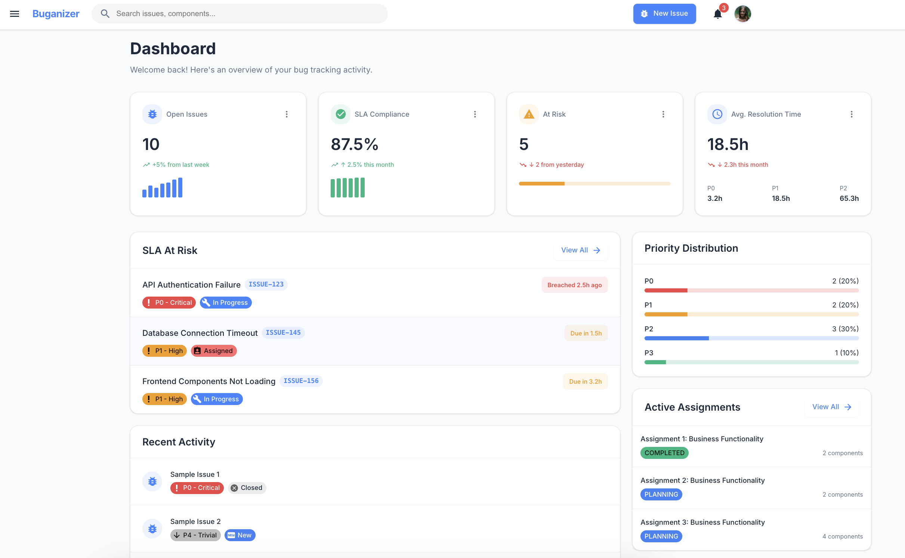

# Buganizer - Issue Tracking System

Buganizer is a comprehensive issue tracking and team collaboration platform built with React, TypeScript, and Material UI. It provides a modern and intuitive interface for teams to manage issues, track assignments, and monitor SLA compliance.

## 📋 Features

- **Issue Tracking**: Create, view, and manage issues with custom fields, priority, and severity levels
- **SLA Management**: Monitor response and resolution times with customizable SLA configurations
- **Team Management**: Organize teams and manage member permissions
- **Assignments**: Group related issues into assignments for better project management
- **Dashboard**: Interactive overview of key metrics and at-risk issues
- **Fine-grained Permissions**: Role-based access control for organization, teams, and projects

## 🖼️ Screenshots

### Dashboard

*The dashboard provides a quick overview of critical metrics, active issues, and SLA compliance.*

### Issue List

*The issue list view with filtering, sorting, and multiple display options.*

### Issue Detail

*Detailed issue view with comments, attachments, and history tracking.*

### Assignments

*Assignments you are working on, these are conceptual similar to projects*


## 🏗️ Project Structure

```
web/
├── src/
│   ├── components/      # React components
│   │   ├── Dashboard/   # Dashboard components
│   │   ├── IssueList/   # Issue listing components
│   │   ├── IssueDetail/ # Issue detail components  
│   │   └── ...
│   ├── hooks/           # Custom React hooks
│   ├── types/           # TypeScript type definitions
│   ├── utils/           # Utility functions
│   └── App.tsx          # Main application component
```

## 🧩 Key Components

### Issue Management

The system provides comprehensive issue management features:

- Create issues with customizable fields
- Set priority (P0-P4) and severity (S0-S3) levels
- Track issue status through its lifecycle
- Comment and attachment support
- History tracking for all changes

### SLA Compliance

SLA tracking is a core feature:

- Configure SLA targets based on priority and severity
- Monitor response and resolution times
- Get notifications for at-risk issues
- Generate compliance reports

### Team Organization

Team management features include:

- Create and manage teams
- Assign roles and permissions to team members
- Team-specific issue views and dashboards
- Performance metrics per team

## 🚀 Getting Started

### Prerequisites

- Node.js (v14+)
- npm or yarn

### Installation

1. Clone the repository:
   ```bash
   git clone https://github.com/your-username/buganizer.git
   cd buganizer
   ```

2. Install dependencies:
   ```bash
   cd web
   npm install
   # or
   yarn install
   ```

3. Start the development server:
   ```bash
   npm start
   # or
   yarn start
   ```

4. Open your browser and navigate to `http://localhost:3000`

### Demo Accounts

For testing, the following demo accounts are available:

- **Admin**: admin@buganizer.dev (password: password)
- **Developer**: developer@buganizer.dev (password: password)
- **Manager**: manager@buganizer.dev (password: password)
- **QA Tester**: tester@buganizer.dev (password: password)

## 👥 User Roles

The system supports four role types with progressive permissions:

1. **Viewer**: Read-only access to issues and teams
2. **Developer**: Can create and update issues
3. **Manager**: Can manage team members and assignments
4. **Admin**: Complete administrative access to all features

## 🧰 Technology Stack

- **Frontend**: React, TypeScript, Material UI
- **State Management**: React Hooks
- **Routing**: React Router
- **API Communication**: Axios
- **Authentication**: JWT
- **Charts & Visualization**: Recharts, Nivo

## 📊 Data Models

### Issue

The core issue model includes:

```typescript
interface Issue {
  id: string;
  title: string;
  description: string;
  reproduceSteps: string;
  componentId: string;
  reporterId: string;
  assigneeId: string | null;
  priority: Priority; // P0-P4
  severity: Severity; // S0-S3
  status: Status;
  dueDate: string | null;
  createdAt: string;
  updatedAt: string;
  labels: string[];
}
```

### SLA Configuration

```typescript
interface SLAConfig {
  componentId: string;
  criticalResponseTime: number; // Hours
  highResponseTime: number;
  mediumResponseTime: number;
  lowResponseTime: number;
  criticalResolutionTime: number;
  highResolutionTime: number;
  mediumResolutionTime: number;
  lowResolutionTime: number;
}
```

## 📝 Contributing

Contributions are welcome! Please feel free to submit a Pull Request.

## 📄 License

This project is licensed under the MIT License - see the LICENSE file for details.

## 📞 Contact

For questions or support, please contact [your-email@example.com](mailto:your-email@example.com).